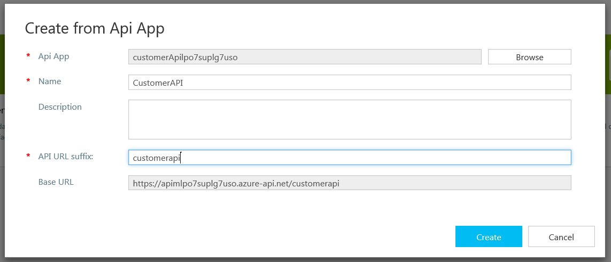
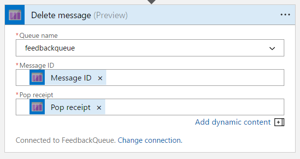

# Customer Loyalty Demo

# What is it?
This repository will provision an environment that may be used as a Lab to build an end to end scenario that does the following:

*	Customer submits a spoken feedback about their latest engagement with support
*	Bing Speech APIs are used to convert speech to text
*	Feedback is submitted to the system
*	Perform sentiment analysis on the feedback and determine if it is negative
*	Legacy API of customer information is queried to retrieve their email
*	Mail them the coupon

# Preparing for the solution

**IMPORTANT:** You need to enable Bing Speech API and Text Analytics API from Cognitive Services on your account first. Have a look here https://docs.microsoft.com/en-us/azure/cognitive-services/cognitive-services-apis-create-account
In short, you need to have created both those APIs from the portal at least once, then deleted them.

# How to install the solution
Hit the Deploy to Azure button to deploy the solution to the subscription you are logged into

This will take roughly 30 minutes as this will provision:

*	An Azure Web App hosting the feedback system
*	An Azure API App hosting the customer API system
*	An Azure Function App with 2 functions (GatherFeedback in C#, GenerateCoupon in nodeJs)
*	An Azure Logic App to be used to orchestrate the workflow
*	Cognitive Services for Text Analytics and Speech To Text
*	An API Management instance (Developer Tier)
*	Storage Account to for Queues and Blob Storage of the generated coupons

# How to run the solution
*	Have a look at the Customer API App that will be deployed at https://customerApi[uniqueId].azurewebsites.net/swagger
	

*	Update the **customers.json** file with your email. You can edit it online here https://customerApi[uniqueId].scm.azurewebsites.net/dev/wwwroot/App_Data/customers.json
	

*	Upload **FunctionApp/GenerateCoupon/coupon.jpg** to **coupons/coupon.jpg** in the Blob Storage account

*	Import Customer API App into API Management
	

	

	

	

	

*	Hit up the API Management Developer Portal, go to your Profile and make note of the Unlimited product Subscription Key
	
	
	

*	Check out the functions (GatherFeedback and GenerateCoupon) deployed in the Function App

	

*	Edit CORS and delete anything other than the * from Allowed Origins

	

*	Test the Feedback Web App that will be deployed at https://feedbackWeb[uniqueId].azurewebsites.net	

	

*	Edit the logic app by adding Queue trigger, then the required actions for Sentiment Analysis, Coupon generation and Email

	
	
		
	@{Json(triggerBody()?['MessageText']).FeedbackText}
	
	

	

	

	
	@{encodeURIComponent(Json(triggerBody()?['MessageText']).PhoneNumber)}
	
	

	
	
	
	"body": {
        "Body": "Here is a discount coupon @{body('GenerateCoupon').CouponUrl}",
        "Subject": "We're sorry you are not satisfied",
        "To": "@{body('Customers_GetCustomerByPhoneNumber')?['Email']}"
    },
	

*	Save the Logic App and go back and add some feedback